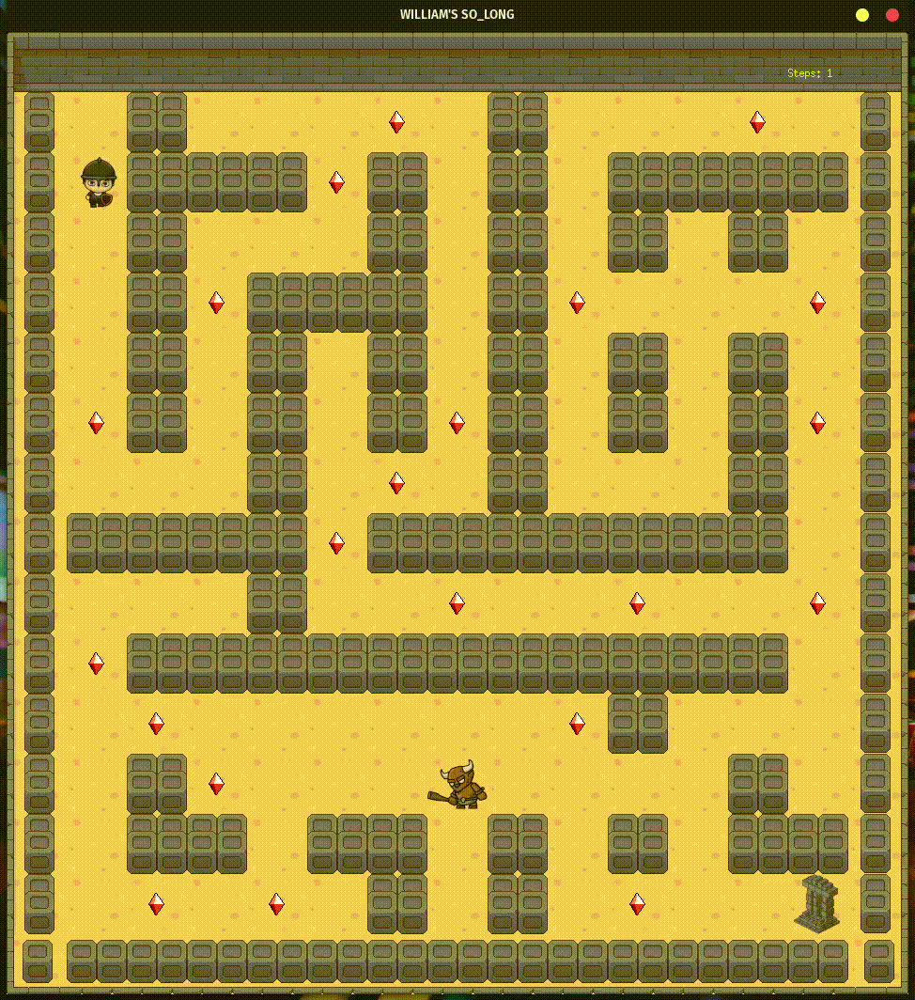

# So_long Project

[](https://opensource.org/license/mit/)
[](https://travis-ci.com/williamroocha/ft_printf)
[](https://42lisboa.com/)

<div style="display: flex; justify-content: center;">
  
</div>

This project is part of the common core curriculum at [42 Lisboa](https://www.42lisboa.com/). The goal is to create a small 2D game using the [minilibx](https://github.com/42Paris/minilibx-linux) library.

## Table of Contents
- [Description](#description)
- [Installation](#installation)
- [Usage](#usage)
- [Conclusions](#conclusions)
- [Credits](#credits)


## Description
The so_long project is a very small 2D game. The goal is to collect all the collectibles and exit the map. The game ends when the player collects all the collectibles and exits the map. The player loses if he touches an enemy and only can exit the map if he has collected all the collectibles. The game is written in C and uses the minilibx library to create the window and draw the images. The game is composed of 5 different images: the player, the collectible, the exit, the enemy and the wall. The player can move using the arrow keys and the enemy moves randomly. 

## Installation
Clone the repository with the following command:
```bash
git clone git@github.com:williamroocha/so_long.git
```

## Usage
After cloning the repository, run the following command:
```bash
make
```
This will create the executable file `so_long`. To run the game, use the following command:
```bash
./so_long maps/valid/map0.ber
```
You can use any of the maps in the `maps/valid` folder. The game will not run if the map is invalid. To create your own map, you can use the following characters:
- `0` for empty space
- `1` for walls
- `C` for collectibles
- `E` for the exit
- `P` for the player
- `M` for the enemy

The map must be surrounded by walls and must have at least one exit, one collectible and one player.The enemy is opitional and the map must also be rectangular and must have the `.ber` extension. Of course, the exit must be reachable.

To control the player use the arrow keys or WASD keys. To exit the game press the `ESC` key, the `Q` key or click the cross on the window. 

To clean the repository, run the following command:
```bash
make fclean
```

## Conclusions
This project was very fun to do. I learned a lot about the minilibx library and how to use it. I also learned how to build a simple 2D game and how to use images in C. 

## Credits

- Developed by: [williamroocha](https://github.com/williamroocha)
- Project for: [42 Lisboa](https://www.42lisboa.com/)